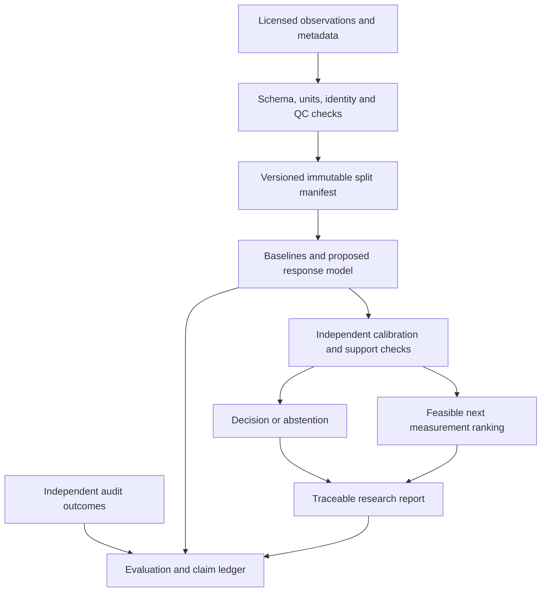

# Execution blueprint for a later implementation round

The implementation round has now begun; see [Document 12](12-implementation-record.md) for evidence of completed and outstanding work. This blueprint retains the original scope and exit gates.

This is a dependency-based plan with no time estimates or calendar allocation. It specifies the work needed for a strong result without claiming that code or experiments have been completed.

## Work packages and exit evidence

| Package | Dependencies | Work | Exit evidence |
|---|---|---|---|
| W0: Eligibility and scope | None | Resolve applicable registration/rubric rules; define rights boundary and intended category | Completed requirements checklist; unresolved items explicitly assigned |
| W1: Biological question | W0 for submission commitments | Define user, endpoint, decision, costs, and supported assay context with qualified domain review | Context-of-use card and prespecified estimand |
| W2: Data admission | W1 | Inspect candidate files, licenses, raw/aggregate status, corrections, replicate hierarchy and missingness | Data cards, counts, manifest, public reproduction route |
| W3: Benchmark lock | W2 | Freeze splits, comparison budget, outcomes and statistical analysis | Versioned evaluation protocol and independent test custody |
| W4: Baselines | W3 | Reproduce assay reference, simple statistical models and strong GP/ML alternatives | Baseline results, failure analysis, tuning records |
| W5: Technical advance | W4 | Implement only diagnosed improvements; test identifiability, transfer and acquisition | Ablations supporting a precise contribution |
| W6: Policy evaluation | W5 | Measured-pool and/or prospective comparison; independent audit data | Cost/error curves and bounded conclusions |
| W7: External validation | W5–W6 | Test independent biology/site; verify uncertainty and subgroup behavior | External effect sizes and limitations |
| W8: Reviewer workflow | W4 onward | Public inference/evaluation route, data provenance, meaningful error handling | Fresh-environment reproduction log |
| W9: Submission evidence | W6–W8 | Prepare report, video and writeup; check every claim/link | Review-ready package with traceable results |
| W10: Defense | W9 | Skeptical scientific and technical questioning; resolve contradictions | Rehearsed evidence-backed answers and backup artifacts |

W0 clarification can run alongside scientific preparation; unanswered questions must not be represented as resolved. Team role assignments are proposals, not authorization to recruit, contact collaborators, or register anyone.

## Scientific roles within the allowed team size

For a five-person team, a useful division is scientific lead; probabilistic-model/optimization lead; data and evaluation lead; engineering/reproduction lead; and biological validation lead. A smaller team can combine roles, but independent review of split design and claims remains valuable. Genuine AI and biological expertise matters for scientific quality regardless of whether the disputed bonus is awarded.

All substantive contributors must be handled consistently with team and outside-sharing rules. Do not exchange core competition work privately with another team. Public prior code is used only under its licenses and attribution requirements.

## Future architecture



This diagram is a specification, not implemented behavior. Human review remains between a recommendation and any real experimental action.

## Future repository layout

```text
src/zenithsync/
  data/          # schemas, units, source adapters, provenance
  models/        # baselines and justified advanced models
  uncertainty/   # calibration and support checks
  acquisition/   # feasible decision-aware selection
  evaluation/    # group-aware metrics and statistical summaries
  reporting/     # evidence-linked exports
configs/         # frozen experiments; no secrets
manifests/       # source versions, hashes, splits, exclusions
tests/           # scientific invariants and integration checks
scripts/         # explicit demo/inference/evaluate entry points
artifacts/       # small reproducible result metadata, not bulk raw data
docs/            # this planning package plus later evidence records
```

Do not create placeholder implementation that looks runnable before there is actual functionality. Future commands must be tested, not included as fictional quick-start instructions.

## Contracts to establish before coding

| Boundary | Required behavior |
|---|---|
| Input | Units explicit; unknown identities preserved as unknown; invalid doses rejected |
| Data split | Biological aliases and duplicate hashes cannot cross prohibited boundaries |
| Model | Outputs include version, context, uncertainty type, supported domain, provenance |
| Missing data | Missing endpoint is not zero; unavailable modality does not trigger invented values |
| Censoring | Preserve inequality and assay limit through fit and evaluation |
| Transfer | Domain mismatch surfaced; target-only fallback is testable |
| Calibration | Calibration set and unit recorded; no unsupported shifted-domain guarantee |
| Acquisition | Candidates feasible, costs positive, no hidden unobserved outcomes consumed |
| Report | Separate observed, inferred, simulated, and unavailable values |
| Failure | Return explicit reason/abstention; never display fabricated successful output |

## Meaningful future tests

Tests should protect scientific invariants: unit conversion equivalence; Hill limits and half-response; positive semidefinite covariance; finite censoring log-likelihoods in tails; proper group isolation; reproducible split creation; duplicate identity detection; train-only preprocessing; calibration rank edge cases; no-data/unsupported-input behavior; acquisition exclusion of invalid conditions; all reported values traceable to runs.

Integration tests should recreate a small known analysis end to end. A clean-environment acceptance run should reproduce the headline table within stated numerical tolerance. Test scientific behavior and failure handling, not merely that implementation-shaped mocks return expected objects.

## Reproducibility modes

Provide a small public demonstration with legally redistributable inputs and a released lightweight model or fitting routine. Provide a separate full evaluation mode with exact acquisition instructions, hashes, environments, and hardware/resource measurements. If large training requires an accelerator, report that cost honestly and make inference/evaluation accessible without proprietary hardware or paid APIs.

Cached outputs may support a backup presentation, but must be labeled recorded results. They must not masquerade as fresh inference. A hosted app is optional; scientific reproduction must survive its outage.

## Resource choices without schedule pressure

Choose compute based on measured data size and algorithmic complexity, not a presumed need for a large GPU. Start with statistically efficient methods for small independent N. Add data collection and external validation because they change evidence quality, even if they dominate the research effort. No paid compute, software installation, or experiment procurement is authorized or performed by this document.

## Definition of implementation completion

Completion requires an actual central result, all required artifacts, independent reproduction, and honest scope. A deployed UI, a trained model file, or a completed checklist alone is insufficient. If the advanced method fails, the final narrative must reflect the strongest supported result rather than the original ambition.
